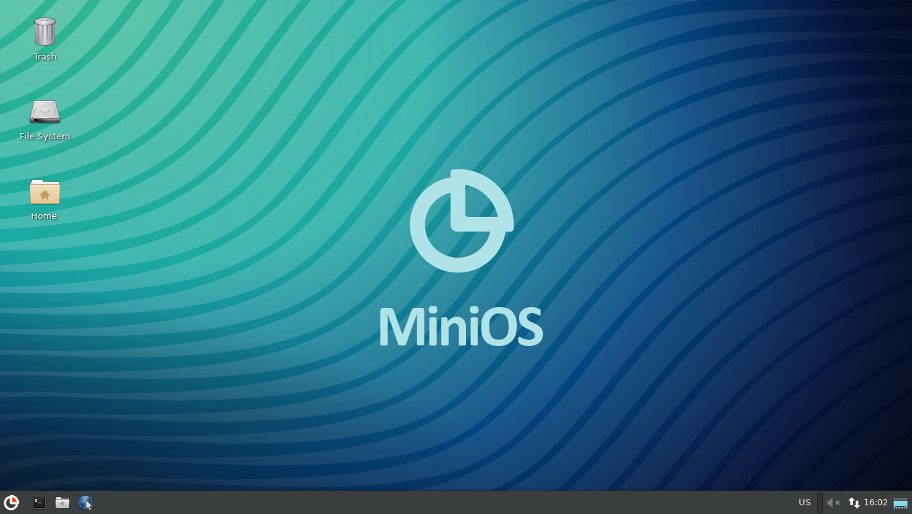

[](https://minios.dev)

Estos scripts construyen una imagen ISO arrancable de MiniOS.

Usando minios-live, puedes construir:

*Debian 9, 10, 11, 12 con entorno FluxBox (análogo a [Slax](https://www.slax.org/)).*

*Debian 9, 10, 11, 12, Testing, Unstable, Kali Linux y Ubuntu 20.04, 22.04 con entorno Xfce4.*

Para construir, necesitas cambiar los parámetros en el archivo **linux-live/buildconfig** para compilar la opción requerida, luego iniciar la opción: `./install -`

Es recomendable utilizar Debian 12 o Ubuntu 22.04 para construir, ya que en este sistema puedes construir MiniOS basados en Debian 9,10,11,12 y Ubuntu 20.04, 22.04. Si tienes otro sistema instalado, utiliza docker.

Para la instalación use **install** \- script de instalación guiada\, **autoinstall** \- script para instalación automática\.

**¡Nunca ejecute scripts desde la carpeta linux-live! Romperán tu sistema.**

**Comandos Soportados:** `setup_host build_bootstrap build_chroot build_live build_modules build_iso`

*setup\_host* \- Instalación de paquetes necesarios para la construcción en el host

*build\_bootstrap* \- Instala un sistema mínimo usando debootstrap

*build\_chroot* \- Instalación del resto de componentes necesarios para poner en marcha el sistema

*build\_live* \- construyen una imagen squashfs

*build\_modules\_chroot* \- Construcción de modulos

*build\_iso* \- Construye la imagen ISO final.

**Syntax:** `./install [start_cmd] [-] [end_cmd]`

* lanzar desde start\_cmd hasta end\_cmd
* si se omite start\_cmd, todos los comandos se ejecutaran comenzando desde el primero
* si se omite end\_cmd, se ejecutan todos los comandos hasta el ultimo
* ingrese un comando para ejecutar un comando especifico
* ingrese '-' como único argumento para ejecutar todos los comandos.

```
  Ejemplos: ./install -
            ./install build_bootstrap - build_chroot
            ./install - build_chroot
            ./install build_bootstrap -
            ./install build_iso
```

Si solo quieres construir el sistema desde el principio, simplemente edita `linux-live/buildconfig` y ejecuta `./install -`

Para construir con docker, crea una carpeta de construcción en tu carpeta personal, coloca `minios-live` allí, usa `cd` para ir a la carpeta `docker` y ejecuta `01-runme.sh`. Esta acción instalará los programas necesarios y creará una imagen. Para iniciar la construcción, edítalo para tí mismo y ejecuta `02-build.sh`. Contenido de archivo de ejemplo:
`docker run --rm -it --name mlc --privileged -v /home/user/build:/build local/mlc install -`
o puede utilizar el script `minios-live/batch-build` editando los parámetros necesarios para usted en lugar de `02-runme.sh`.

Author: crims0n [https://minios.dev](https://minios.dev)
